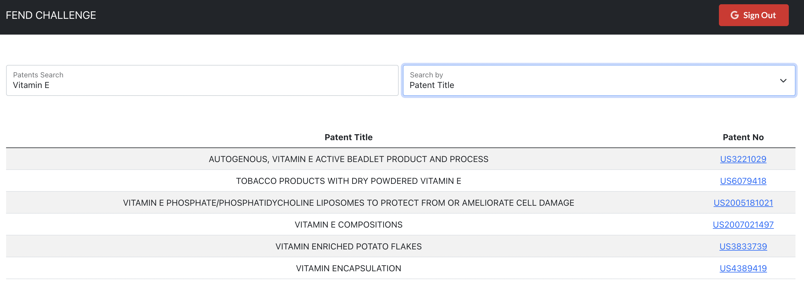
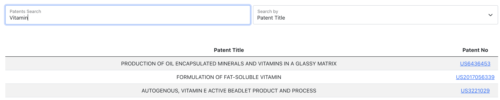
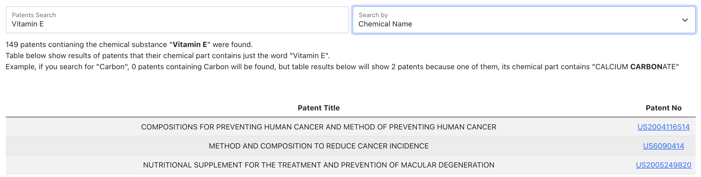

# FrontEnd Challenge, client side

This app render patents results based on instanteneous searched words. Words can be a part of a patent title or a chemical type used on the patent claim. User can choose between two by selecting the search type he wants to use.

For both search types, a table of results will be shown, it includes patents title and their number. Patent No if clicked will take the user to the Google patent website.
If you search using chemical type mode, then a part will show up showing how many patents are using this chemical type.

To be able to use this search app, user must login first using his Google account.

Results received in this app are the result of an the consumption of an API that was build mainly for this app using ExpressJs. This Backend app is deployed on [Heroku](https://fend-challenge.herokuapp.com/api/v1/patents).

Packages used: axios, react-bootstrap.

## Installation

Clone the repository, change directories, and use YARN to install the dependencies.

```bash
$ gh repo clone khmais93/fend-challenge-client
$ cd fend-challenge-client
$ yarn install
```

## Usage

The project can be run with

- `yarn start`

The project can be viewed in the browser at

- [http://localhost:3000](http://localhost:3000)

## Screenshots

### Home Page



### Search by title



### Search by chemical type


